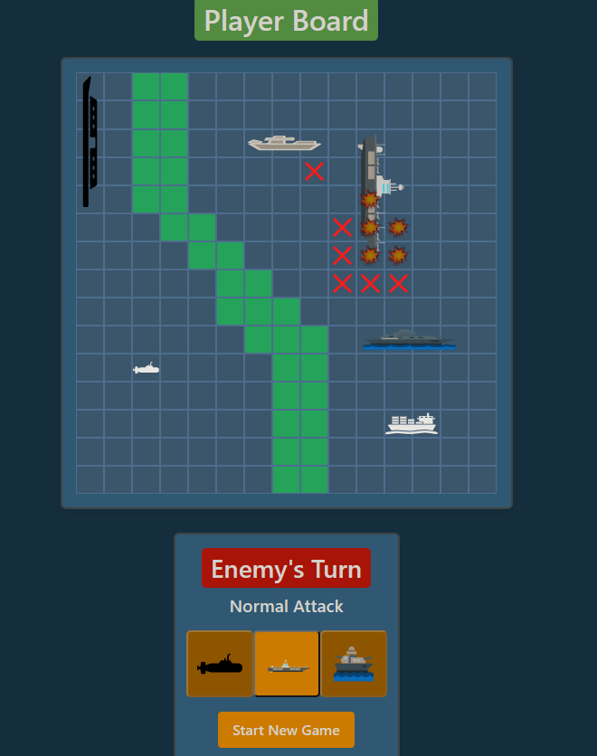

# Battleship++

An extended version of the classic game Battleship, including new maps, new ships, ship abilities, and an AI to play against!



## Table of Contents

- [Live Demo](#live-demo)
- [Features](#features)
- [Installation](#installation)
- [Usage](#usage)
- [Design & Architecture](#design--architecture)

## Live Demo

You can play the game online [here](https://pedroavj.github.io/battleship/).

## Features

- Responsive design for desktop and mobile devices
- Single-player mode against an AI opponent
- Various maps to choose from
- New ship types with unique abilities
- Intuitive drag-and-drop interface for ship placement

## Installation

To set up the project locally, follow these steps:

1. Clone the repository:

```git clone https://github.com/pedroavj/battleship.git```

2. Change into the project directory:

```cd battleship```

3. Install dependencies:

```npm install```

## Usage

To run the development server and access the game locally:

1. Start the development server:

```npm run serve```

2. Open your browser and navigate to the local server URL (usually http://localhost:8080).

## Design & Architecture

The reason I chose to build a battleship clone is twofold: first, I wanted to showcase something that was inherently visual, as I believe that it is easiest to gauge a systems complexity when you can see it in action, compared to something like a form. Second, I wanted something that requiered a challenging amount of logic, mostly in how coupled certain components were, and how to manage state between them.

### Stack

The project was built using Vue 3 and Typescript. I used Pinia for state management as it is the more modern solution and comes with built-in Typescript support (as opposed to Vuex, which uses magic strings) and Vue Router for navigation. I also used Bootstrap 5 for the carousel and the modals.

The components themselves all use TS, and are written using the composition API. This provides a lot more flexibility when it comes to making the code readable, which was very important as I have worked with the options API before and found it very easy to lose track of what was going on.

I also use the pinia persisted state plugin to save the game state to local storage, so that the game can be resumed after a refresh.

### Architecture

The most reelevant parte of the architecture is the flow between the Board, the Square and the sprite. Because both the enemy and the player requiere a slightly different implementation of the Board, I decided to create a PlayerBoard, EnemyBoard and MapBoard. The PlayerBoard is the one that is used to place the ships, and the EnemyBoard is the one that is used to play the game. The MapBoard is a simple component that displays the map selection screen. Even if some little code is repeated, they require very different and long implementations, so I decided to keep them separate, instead of using a system like passing a prop to the Board to determine if it is the player, enemy or map board.

### Design

Most of the low level logic is implement inside my Game.ts file, inside the utils folder. It's mainly a collection of utility functions for universal tasks like ship placement, tile checking and board resolutions. One thing I did do that is not recommended is the fact that only for the board properties inside my RootState I decided to not use an explicit action in order to mutate it, this is because I manipulate the board everywhere, and having to write a bunch of boilerplate code for every single action would have been a pain. The tradeoff was that there were certain things I had to do to as not all reactivity gets triggered by the board being mutated, for example my modals displaying if the player or computer won.

### AI

The computers algorithm is relativly straight forward. It first randomly choose if it should use an ability, based on the current health of said ships, so if a ship has a lower health it will be more likely to use the ability.

The next part will always shoot at a tile were an uncovered ship is.

If there isn't an uncovered ship. It will try to shoot at a tile that is adjacent to a ship, as it is more likely that the ship is in that direction. Because all ships are longer than they are wide, it will always shoot in the direction of the longest straight line of hits.

Finally if there aren't any hits that can't be accounted for in the board. We use a Monte Carlo algorithm to randomly place the remaining ships, and generate a heatmap of the most likely places for the ships to be. The computer will then shoot at the tile with the highest probability of containing a ship.